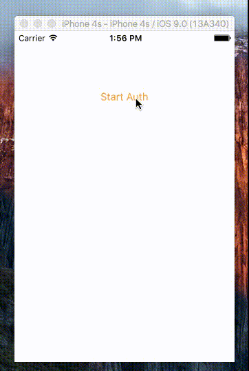

# DKAuthenticationViewController

Simple authentication view controller for iOS



# Installation

## [CocoaPods](https://cocoapods.org/)

``` ruby
platform :ios, '8.0'
pod 'DKAuthenticationViewController'
```

## Manual

Add the files in the DKAuthenticationViewController folder to your project.

## Usage

``` objc
    DKAuthenticationViewController *authController = [[DKAuthenticationViewController alloc] init];
    authController.twitter = YES;
    authController.cellBackgroundColor = [[self highlightColor] colorWithAlphaComponent:.1];
    authController.passwordLength = 5;
    
    UINavigationController *navigationController = [[UINavigationController alloc] initWithRootViewController:authController];
    [self presentViewController:navigationController animated:YES completion:nil];
```

`DKAuthenticationViewController` has two properties that use protocols to decouple functionality:
- the `hud` property uses the [`DKHudProtocol`](https://github.com/dkhamsing/DKAuthenticationViewController/blob/master/DKAuthenticationViewController/DKHudProtocol.h) to display a loading spinner
- the `authentication` property uses the [`DKAuthenticationProtocol`](https://github.com/dkhamsing/DKAuthenticationViewController/blob/master/DKAuthenticationViewController/DKAuthenticationProtocol.h) to login, sign up, logout, etc...

To use a protocol, simply create an object that conforms to it (implements its methods) and assign it as a property to your instance of `DKAuthenticationViewController` (for `DKHudProtocol`, you would create an object that implements `- hideInView:animationDuration` and `- showInView:animationDuration`).

# Demo

DKAuthenticationViewController includes a demo project.

# Dependencies

DKAuthenticationViewController uses the Apple's [Accounts](https://developer.apple.com/library/prerelease/ios/documentation/Accounts/Reference/AccountsFrameworkRef/index.html) framework and [DKTwitterReverseAuth](https://github.com/dkhamsing/DKTwitterReverseAuth) for Twitter reverse authentication.

# Contact

- [github.com/dkhamsing](https://github.com/dkhamsing)
- [twitter.com/dkhamsing](https://twitter.com/dkhamsing)

# License

DKAuthenticationViewController is available under the MIT license. See the [LICENSE](LICENSE) file for more info.
